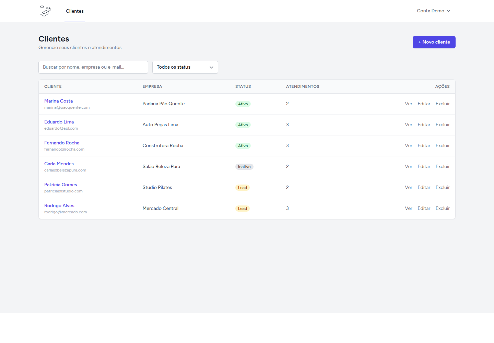
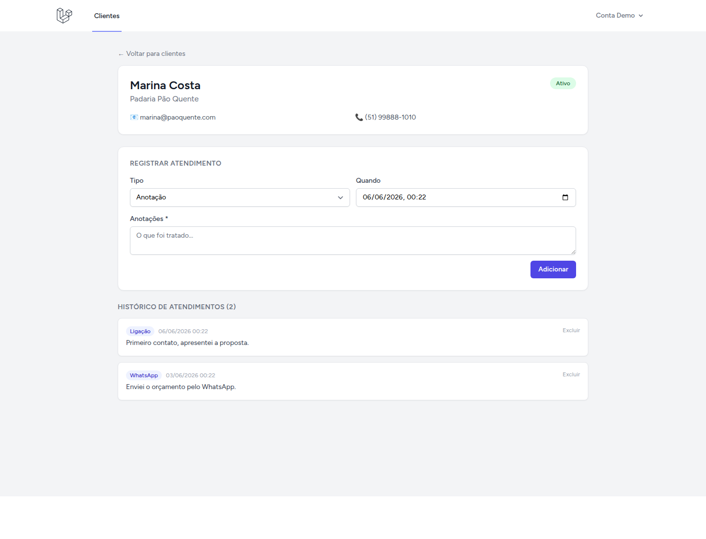

# Clientela

> Mini-CRM para **gerenciar clientes e atendimentos** — cadastro, busca, status e histórico de contatos. Feito com **Laravel 12 + Livewire 3**.

[](https://github.com/ReneMartins1983/Clientela/actions/workflows/ci.yml)


Aplicação web onde cada usuário cria uma conta e gerencia sua **carteira de clientes**:
cadastra clientes (com status lead/ativo/inativo), registra **atendimentos/follow-ups**
e acompanha o histórico — útil para freelancers e pequenos negócios.

## 📸 Telas

| Lista de clientes | Cliente + atendimentos |
| --- | --- |
|  |  |

## ✨ Funcionalidades

- 🔐 **Contas de usuário** (Breeze) — cada um vê apenas os seus clientes.
- 👤 **CRUD de clientes** com **busca** e **filtro por status** (lead/ativo/inativo).
- 🗂️ **Atendimentos por cliente** (ligação, e-mail, reunião, WhatsApp, anotação) com histórico.
- ⚡ Interface reativa com **Livewire** (sem recarregar a página, sem escrever API/JS).
- 🌙 Modo escuro · 🧪 testes · CI.

## 🛠️ Stack

| Camada    | Tecnologia                              |
| --------- | --------------------------------------- |
| Back-end  | Laravel 12 · PHP 8.3                     |
| UI        | **Livewire 3** · Blade · Tailwind CSS    |
| Auth      | Laravel Breeze                           |
| Banco     | MySQL 8.4                                |
| Ambiente  | Docker (PHP-FPM, Nginx, MySQL, Node 20)  |

## 🏗️ Arquitetura

- **Componentes Livewire** (`app/Livewire/Clients`, `ClientShow`) cuidam de toda a interação
  (lista, busca, modal de CRUD, atendimentos) — renderização no servidor, reatividade sem API.
- **Posse** garantida no servidor: todas as consultas são escopadas a `auth()->user()`,
  e abrir/editar cliente de outro usuário retorna **403**.
- Models `Client` (1‑N) `Interaction`.

## 🚀 Como rodar

Pré-requisitos: **Docker** e **Docker Compose**.

```bash
cp .env.example .env

UID=$(id -u) GID=$(id -g) docker compose build app
docker compose up -d
docker compose exec app composer install
docker compose exec app php artisan key:generate
docker compose exec app php artisan migrate --seed
docker compose run --rm node npm install
docker compose run --rm node npm run build
```

Acesse **http://localhost:8003**. Conta de demonstração (semeada):

```
e-mail: demo@clientela.app
senha:  password
```

## 🧪 Testes

```bash
docker compose exec app php artisan test
```

## 📄 Licença

MIT.
